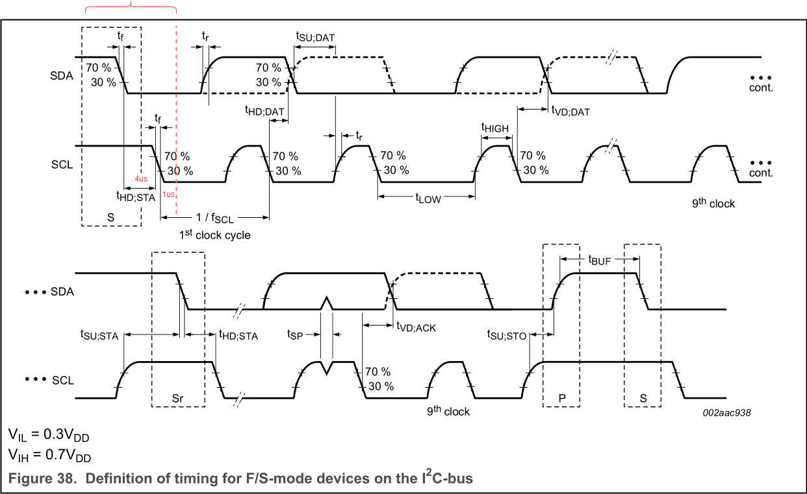
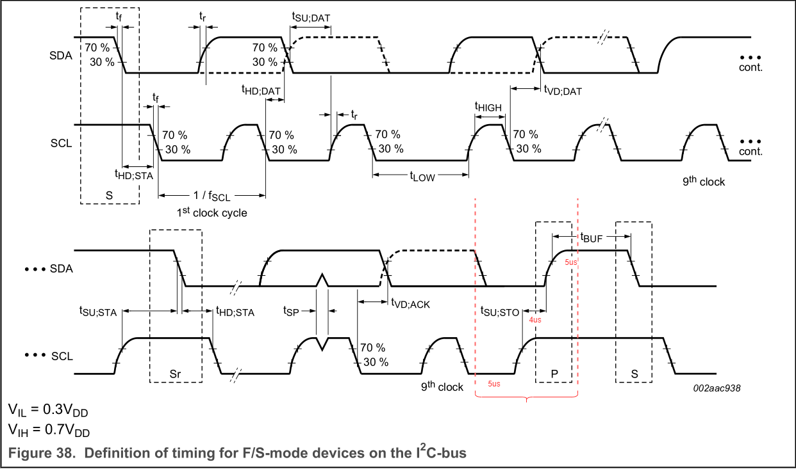

## 

## 时钟延展

## 总线挂死


## I2C子系统 Linux内核实现
TODO

## 软件模拟I2C Master(GPIO模拟)

### 检测总线是否空闲

### 发送START
```c
// 确保总线空闲
// HOW TO
us_delay(4); // 额外的

SDA=1;SCL=1;
// 是否需要延时？延时多少

// START 符号
SDA=0;SCL=1;
// T_hd;sta > 4.0 us
us_delay(4);

SDA=0;SCL=0;
```




## 发送
```c
// T_low > 4.7, T_high > 4.0us 
SCL = 0;
us_delay(5);

// 数据
SDA = xx;
// T_su;dat > 250ns
us_delay(1);

// 拉高SCL
SCL = 1;
// T_high > 4.0us
us_delay(4);

// 拉低SCL
SCL = 0;
// T_high > 4.0us
us_delay(1);
```


## 停止
```c
SDA=0;SCL=0;
us_delay(5);

SCL=1;
// T_su;sto > 4.0us
us_delay(4);

SDA=0;
// T_hd;dat
us_delay(5);
```




## GPIO 模式配置(ST/GD)

- 输入
    - 浮空输入

- 输出
    - 开漏输出模式
    - NOPULL 模式
    - FREQ HIGH模式

GD32、STM32在GPIO 输出配置章节有如下描述;
```
开漏模式：输出控制寄存器设置为“0”时，相应引脚输出低电平；输出控制寄存器设置 为
“1”，相应管脚处于高阻状态；
```

### 为什么不能直接使用芯片内部的上拉电阻
内部实现的是弱上拉(40K Ohm), 不满足时序要求；
外部上拉电阻一般使用4.7K Ohm;


## I2C Slave

## 学习文档
1. UM10204(I2C-bus specification and user manual) Texas Instruments 
2. 
