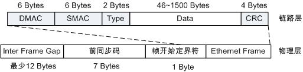
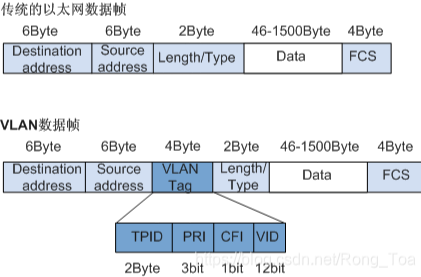

<!--more-->

## MAC 报文格式

### Ethernet 帧格式

### Ethernet II 帧格式

### VLAN帧格式

IEEE 802.1Q标准对Ethernet帧格式进行了修改，在源MAC地址字段和协议类型字段之间加入4字节的802.1Q Tag。

## LSW原理

## 参考
1. [报文格式地图](https://protocol.aymar.cn/)
