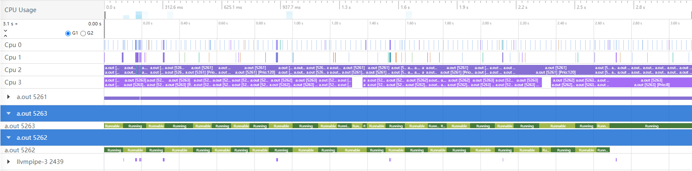
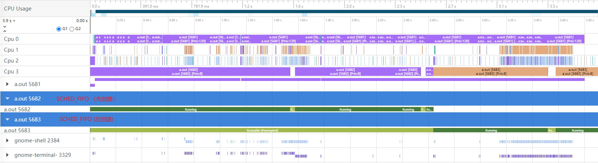
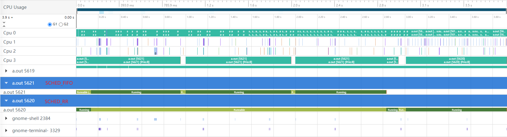

# 图解Linux系统RT调度(SCHED_FIFO与SCHED_RR)


&lt;!--more--&gt;

## RT调度与完全公平调度


引入多核的话事情会变得复杂起来，先从简单的场景入手

## SCHED_FIFO 调度

那么SCHED_FIFO是否可以一直占用CPU？答案是否定的。
在单核系统中，如果允许SCHED_FIFO任务一直占用CPU不释放，则普通任务永远得不到调度;


## 调度轨迹抓取及可视化工具

### 调度轨迹抓取脚本

```sh
#!/bin/bash

echo &#34;&#34; &gt; /sys/kernel/tracing/trace 
echo 1 &gt; /sys/kernel/tracing/events/sched/enable
echo 80920 &gt; /sys/kernel/tracing/buffer_size_kb
echo 1 &gt; /sys/kernel/tracing/tracing_on
# 执行需要抓取调度轨迹的程序
# ./a.out
echo 0 &gt; /sys/kernel/tracing/tracing_on
cat /sys/kernel/tracing/trace  &gt; /root/trace_out
```

### 可视化工具

Huawei SmartPerf


## 实验

Tested on 4Core@Ubuntu-24.04-VirtualBox

### 单核实验
实验: 2个SCHED_RR任务, 均绑定到核3

实验预期:




实验: 2个SCHED_FIFO任务, 均绑定到核3




实验: 1个SCHED_RR任务, 1个SCHED_FIFO任务, 均绑定到核3




实验代码
```c
#define _GNU_SOURCE
#include &lt;sched.h&gt;
#include &lt;stdint.h&gt;
#include &lt;pthread.h&gt;
#include &lt;stdio.h&gt;
#include &lt;unistd.h&gt;
#include &#34;time.h&#34;

void payload(int s)
{
	int a,b;
	for (uint64_t i = 0; i &lt; 100000000 * s; i&#43;&#43; ) {	
		a = b &#43; i;	
	}
}

void set_affinity(int p)
{
	cpu_set_t cpuset;
	CPU_ZERO(&amp;cpuset);
	CPU_SET(p, &amp;cpuset);
	if (sched_setaffinity(0, sizeof(cpuset), &amp;cpuset)) {
		printf(&#34;bind cpu faild\n&#34;);
	}
}

void* rt_fifo_entry1(void *data)
{
    struct sched_param sp = {0};
    sp.sched_priority = 91;
    // if (sched_setscheduler(0, SCHED_RR, &amp;sp)) {
    if (sched_setscheduler(0, SCHED_FIFO, &amp;sp)) {

    	printf(&#34;thread set sched_fifo failed\n&#34;);
    }
    set_affinity(3);
    printf(&#34;thread-1 create, tid: %u\n&#34;, gettid());
    
    payload(10);
}

void* rt_fifo_entry2(void *data)
{
    struct sched_param sp = {0};
    sp.sched_priority = 91;
    // if (sched_setscheduler(0, SCHED_RR, &amp;sp)) {
    if (sched_setscheduler(0, SCHED_FIFO, &amp;sp)) {
    	printf(&#34;thread set sched_fifo failed\n&#34;);
    }
    set_affinity(3);
    printf(&#34;thread-2 create, tid: %u\n&#34;, gettid());
    payload(10);
}


int main()
{
	pthread_t t;

	pthread_create(&amp;t, NULL, rt_fifo_entry2, NULL);
	pthread_create(&amp;t, NULL, rt_fifo_entry1, NULL);

    	printf(&#34;main thread: %u\n&#34;,getpid());
	payload(15);
	struct timespec tv={0};
	sched_rr_get_interval(getpid(), &amp;tv);
	printf(&#34;sched_rr_interval: %.2lf ms\n&#34;, tv.tv_sec * 1e6 &#43; tv.tv_nsec / 1e6);
	printf(&#34;main thread done, exit\n&#34;);
	return 0;
}
```

管理员可以限制 SCHED_FIFO 带宽，以防止实时应用程序程序员启动对处理器进行单调执行的实时任务。

以下是此策略中使用的一些参数：

/proc/sys/kernel/sched_rt_period_us
此参数以微秒为单位定义时间，它被视为处理器带宽的 10%。默认值为 1000000 InventoryServices，或 1 秒。
/proc/sys/kernel/sched_rt_runtime_us
此参数以微秒为单位定义运行实时线程的时间周期。默认值为 950000 μs，即 0.95 秒。

### 多核实验
实验: 2个SCHED_FIFO任务, 均绑定到 


实验: 3个SCHED_FIFO任务, 分别绑定1~3核


实验: 2个SCHED_FIFO任务, 均绑定到 


## 参考
1. 

---

> Author: Kristoffer  
> URL: https://psuvtk.github.io/posts/0ec2c86/  

