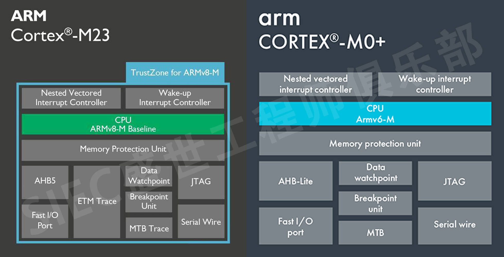

# MCU开发踩坑

## 串口输出乱码

时钟配置不正确

# Cortex-M0 与 Cortex-M23

# Cortex-M3 与 Cortex-M33

---

> Author: Kristoffer  
> URL: https://psuvtk.github.io/posts/19.-mcu-%E5%BC%80%E5%8F%91%E8%B8%A9%E5%9D%91/  

