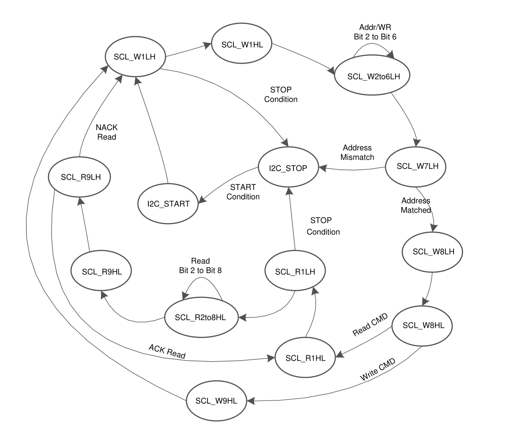

# I2C总线


## 

## 时钟延展

## 总线挂死


## I2C子系统 Linux内核实现
TODO

## 软件模拟I2C Master(GPIO模拟)

### 检测总线是否空闲

### 发送START
```c
// 确保总线空闲
// HOW TO
us_delay(4); // 额外的

SDA=1;SCL=1;
// 是否需要延时？延时多少

// START 符号
SDA=0;SCL=1;
// T_hd;sta &gt; 4.0 us
us_delay(4);

SDA=0;SCL=0;
```


## 发送
```c
// T_low &gt; 4.7, T_high &gt; 4.0us 
SCL = 0;
us_delay(5);

// 数据
SDA = xx;
// T_su;dat &gt; 250ns
us_delay(1);

// 拉高SCL
SCL = 1;
// T_high &gt; 4.0us
us_delay(4);

// 拉低SCL
SCL = 0;
// T_high &gt; 4.0us
us_delay(1);
```


## 停止
```c
SDA=0;SCL=0;
us_delay(5);

SCL=1;
// T_su;sto &gt; 4.0us
us_delay(4);

SDA=0;
// T_hd;dat
us_delay(5);
```


## GPIO 模式配置(ST/GD)

- 输入
    - 浮空输入

- 输出
    - 开漏输出模式
    - NOPULL 模式
    - FREQ HIGH模式

GD32、STM32在GPIO 输出配置章节有如下描述;
```
开漏模式：输出控制寄存器设置为“0”时，相应引脚输出低电平；输出控制寄存器设置 为
“1”，相应管脚处于高阻状态；
```

### 为什么不能直接使用芯片内部的上拉电阻
内部实现的是弱上拉(40K Ohm), 不满足时序要求；
外部上拉电阻一般使用4.7K Ohm;


## I2C Slave




### TI 参考代码

- fr2111_swi2c_master.h
```c
/* --COPYRIGHT--,BSD
 * Copyright (c) 2016, Texas Instruments Incorporated
 * All rights reserved.
 *
 * Redistribution and use in source and binary forms, with or without
 * modification, are permitted provided that the following conditions
 * are met:
 *
 * *  Redistributions of source code must retain the above copyright
 *    notice, this list of conditions and the following disclaimer.
 *
 * *  Redistributions in binary form must reproduce the above copyright
 *    notice, this list of conditions and the following disclaimer in the
 *    documentation and/or other materials provided with the distribution.
 *
 * *  Neither the name of Texas Instruments Incorporated nor the names of
 *    its contributors may be used to endorse or promote products derived
 *    from this software without specific prior written permission.
 *
 * THIS SOFTWARE IS PROVIDED BY THE COPYRIGHT HOLDERS AND CONTRIBUTORS &#34;AS IS&#34;
 * AND ANY EXPRESS OR IMPLIED WARRANTIES, INCLUDING, BUT NOT LIMITED TO,
 * THE IMPLIED WARRANTIES OF MERCHANTABILITY AND FITNESS FOR A PARTICULAR
 * PURPOSE ARE DISCLAIMED. IN NO EVENT SHALL THE COPYRIGHT OWNER OR
 * CONTRIBUTORS BE LIABLE FOR ANY DIRECT, INDIRECT, INCIDENTAL, SPECIAL,
 * EXEMPLARY, OR CONSEQUENTIAL DAMAGES (INCLUDING, BUT NOT LIMITED TO,
 * PROCUREMENT OF SUBSTITUTE GOODS OR SERVICES; LOSS OF USE, DATA, OR PROFITS;
 * OR BUSINESS INTERRUPTION) HOWEVER CAUSED AND ON ANY THEORY OF LIABILITY,
 * WHETHER IN CONTRACT, STRICT LIABILITY, OR TORT (INCLUDING NEGLIGENCE OR
 * OTHERWISE) ARISING IN ANY WAY OUT OF THE USE OF THIS SOFTWARE,
 * EVEN IF ADVISED OF THE POSSIBILITY OF SUCH DAMAGE.
 * --/COPYRIGHT--*/
//*****************************************************************************

#include &lt;msp430.h&gt;
#include &lt;stdbool.h&gt;
#include &lt;stdint.h&gt;

/* Pin Definitions. These  should be changed depending on the device that
 * you are using.
 */
#define SWI2C_SCL         BIT3
#define SWI2C_SDA         BIT2
#define SWI2C_PxDIR       P1DIR
#define SWI2C_PxOUT       P1OUT
#define SWI2C_PxIN        P1IN
#define SWI2C_SDA_LOW     SWI2C_PxDIR |= SWI2C_SDA
#define SWI2C_SCL_LOW     SWI2C_PxDIR |= SWI2C_SCL
#define SWI2C_SCL_HIGH    SWI2C_PxDIR &amp;= ~SWI2C_SCL
#define SWI2C_SDA_HIGH    SWI2C_PxDIR &amp;= ~SWI2C_SDA

/* Defines the buffer size to be used. This will change depending on your
 * application and the size requirements for the transfer.
 */

/* Configuration structure for performing an I2C transaction */
typedef struct _SWI2C_I2CTransaction
{
    uint8_t             address;
    uint_fast16_t       numWriteBytes;
    uint8_t*            writeBuffer;
    uint_fast16_t       numReadBytes;
    uint8_t*            readBuffer;
    bool                repeatedStart;
} SWI2C_I2CTransaction;

/* Timer period for determining the clock rate of the I2C data clock. Note that
 * the timer is sourced from SMCLK and that this number is equal to the duration
 * of roughly HALF a clock period. For example, if SMCLK is set to 3MHz and the
 * period below is set to 15, we would end up with an I2C data rate of
 * approximately 100Khz.
 *
 * In short, the I2C data rate frequency can be calculated by:
 *
 * I2C Data Rate =      SMCLK Frequency
 *                    ___________________
 *
 *                      2 * TimerPeriod
 */
#define SWI2C_TIMER_PERIOD  15

/* Macro for a timer iteration */
#define TIMER_ITERATION()            TB0CCTL0 &amp;= ~(CCIFG);           \
                                     while(!(TB0CCTL0 &amp; CCIFG));

/* Function Prototypes */

//*****************************************************************************
//
//! Initializes the software I2C master. This function takes the port
//! definitions that are given above and configures the device for software
//! I2C operation.
//!
//! \return None
//
//*****************************************************************************
extern void SWI2C_initI2C(void);

//*****************************************************************************
//
//! Starts an I2C transaction over the configured I2C master device. Note that
//! this function is blocking until the transaction is completed. If a timeout
//! feature is required, the user should use the watchdog module of their MCU
//! in tandem with this function. Since the I2C slave has the ability to
//! &#34;clock stretch&#34; the module, care has to be taken to manage the real time
//!  behavior of the main application.
//!
//! &lt;hr&gt;
//! &lt;b&gt;Configuration options for \link SWI2C_I2CTransaction \endlink structure.&lt;/b&gt;
//! &lt;hr&gt;
//!
//! \param address I2C Slave Address to communicate with.
//! \param numWriteBytes Number of bytes for the master to write
//! \param writeBuffer Pointer to the buffer to write
//! \param numReadBytes Number of bytes to read
//! \param readBuffer Pointer to the buffer to read values into
//! \param repeatedStart In the event that both a read and write operation are
//!         requested, this bool value determines if a repeated start coniditon
//!         is sent out over the bus. If set to true, no I2C STOP is sent out
//!         after the write transaction. If set to false. After the write
//!         transaction completes an I2C STOP condition is sent out, and then
//!         the I2C read transaction is treated as a completely separate
//!         transaction
//!
//! Note that any order of combinations can be passed into the transaction
//! structure. If the user wants to only perform an I2C read, then only the
//! read parameters should be populated and the write parameters should be
//! set to 0 (or vice versa for write). The user can also specify both read
//! and write bytes and use the repeatedStart parameter to specify if there
//! is an I2C STOP between the transactions. Note that the write transaction
//! is always first when using this function.
//!
//! \return true if the operation passed, false otherwise. A false return
//!     value means that the device received a NAK where one was not expected.
//
//*****************************************************************************
extern bool SWI2C_performI2CTransaction(SWI2C_I2CTransaction *i2cTransaction);
```

- fr2111_swi2c_master.c
```c
/* --COPYRIGHT--,BSD
 * Copyright (c) 2016, Texas Instruments Incorporated
 * All rights reserved.
 *
 * Redistribution and use in source and binary forms, with or without
 * modification, are permitted provided that the following conditions
 * are met:
 *
 * *  Redistributions of source code must retain the above copyright
 *    notice, this list of conditions and the following disclaimer.
 *
 * *  Redistributions in binary form must reproduce the above copyright
 *    notice, this list of conditions and the following disclaimer in the
 *    documentation and/or other materials provided with the distribution.
 *
 * *  Neither the name of Texas Instruments Incorporated nor the names of
 *    its contributors may be used to endorse or promote products derived
 *    from this software without specific prior written permission.
 *
 * THIS SOFTWARE IS PROVIDED BY THE COPYRIGHT HOLDERS AND CONTRIBUTORS &#34;AS IS&#34;
 * AND ANY EXPRESS OR IMPLIED WARRANTIES, INCLUDING, BUT NOT LIMITED TO,
 * THE IMPLIED WARRANTIES OF MERCHANTABILITY AND FITNESS FOR A PARTICULAR
 * PURPOSE ARE DISCLAIMED. IN NO EVENT SHALL THE COPYRIGHT OWNER OR
 * CONTRIBUTORS BE LIABLE FOR ANY DIRECT, INDIRECT, INCIDENTAL, SPECIAL,
 * EXEMPLARY, OR CONSEQUENTIAL DAMAGES (INCLUDING, BUT NOT LIMITED TO,
 * PROCUREMENT OF SUBSTITUTE GOODS OR SERVICES; LOSS OF USE, DATA, OR PROFITS;
 * OR BUSINESS INTERRUPTION) HOWEVER CAUSED AND ON ANY THEORY OF LIABILITY,
 * WHETHER IN CONTRACT, STRICT LIABILITY, OR TORT (INCLUDING NEGLIGENCE OR
 * OTHERWISE) ARISING IN ANY WAY OUT OF THE USE OF THIS SOFTWARE,
 * EVEN IF ADVISED OF THE POSSIBILITY OF SUCH DAMAGE.
 * --/COPYRIGHT--*/
//*****************************************************************************

#include &#34;fr2111_swi2c_master.h&#34;

/* Static Functions */
static bool SWI2C_readData(uint8_t addr,  uint8_t *inputArray,
                            uint_fast16_t size);
static bool SWI2C_writeData(uint8_t addr, uint8_t *outputArray, 
                                uint_fast16_t size, bool sendStop);

void SWI2C_initI2C(void)
{
    /* Using the direction pin to control the output. When set as an input, the
        hardware pull-ups will take over and cause the pin to go high. When
        set as an output, the MSP430 will drive the lines low */
    SWI2C_PxOUT &amp;= ~(SWI2C_SCL | SWI2C_SDA);
    SWI2C_SCL_HIGH;
    SWI2C_SDA_HIGH;

    PM5CTL0 &amp;= ~LOCKLPM5;                   // Disable the GPIO power-on default high-impedance mode
                                            // to activate previously configured port settings

    /* Timer is initialized to run off SMCLK(8MHz) with frequency 200KHz */
    TB0CCR0 = SWI2C_TIMER_PERIOD;
}

bool SWI2C_performI2CTransaction(SWI2C_I2CTransaction *i2cTransaction)
{
    if(i2cTransaction-&gt;numWriteBytes &gt; 0)
    {
        /* Only skipping the stop if we have a repeated start to send */
        if(i2cTransaction-&gt;repeatedStart &amp;&amp; i2cTransaction-&gt;numReadBytes &gt; 0)
        {
            if (!SWI2C_writeData(i2cTransaction-&gt;address,
                    i2cTransaction-&gt;writeBuffer, i2cTransaction-&gt;numWriteBytes,
                    false))
            {
                return false;
            }
        }
        else
        {
            if (!SWI2C_writeData(i2cTransaction-&gt;address,
                    i2cTransaction-&gt;writeBuffer, i2cTransaction-&gt;numWriteBytes,
                    true))
            {
                return false;
            }
        }
    }

    /* Next doing the read */
    if (i2cTransaction-&gt;numReadBytes &gt; 0)
    {
        if (!SWI2C_readData(i2cTransaction-&gt;address, i2cTransaction-&gt;readBuffer,
                i2cTransaction-&gt;numReadBytes))
        {
            return false;
        }
    }
    
    return true;
}

static bool SWI2C_writeData(uint8_t addr, uint8_t *outputArray, 
                                uint_fast16_t size, bool sendStop)
{
    uint_fast8_t bits, temp;
    uint16_t ii = 0;

    /* Starting the timer */
    TB0CTL = TBSSEL_2 &#43; MC_1 &#43; TBCLR;

    /* Sending the START */
    SWI2C_SDA_LOW;
    __no_operation();
    SWI2C_SCL_LOW;
    TIMER_ITERATION();
    
    /* Next doing the control byte */
    temp = (addr &lt;&lt; 1);
    bits = 8;
    
    /* Loop until all bits of the address byte are sent out */
    do
    {
        /* Deciding if we want to send a high or low out of the line */
        if (temp &amp; BIT7) 
        {                  
            SWI2C_SDA_HIGH;
        }
        else
        {
            SWI2C_SDA_LOW;
        }                 

        /* Now that we set the SDA line, we have to send out a clock pulse */
        SWI2C_SCL_HIGH;
        TIMER_ITERATION();

        /* Incrementing to the next bit and waiting for the next clock cycle */
        temp = (temp &lt;&lt; 1);
        bits = (bits - 1);
        
        SWI2C_SCL_LOW;
        TIMER_ITERATION();


    } while (bits &gt; 0);
    
    /* Detecting if we have a NAK on the bus. If the slave device NAKed the 
        control byte, it probably isn&#39;t there on the bus so we should send
         an I2C stop and return false */
    SWI2C_SDA_HIGH;
    SWI2C_SCL_HIGH;
    /*
    * Waiting for our clock line to go high if the slave is stretching
    */
    while(!(SWI2C_PxIN &amp; SWI2C_SCL));

    TIMER_ITERATION();

    if(SWI2C_PxIN &amp; SWI2C_SDA)
    {
        goto I2CWriteTransactionCleanUp;
    }
    
    /* Sending out another clock cycle */
    SWI2C_SCL_LOW;
    TIMER_ITERATION();
    
    /* Next, let us send out all bytes in the user buffer */
    for(ii=0;ii&lt;size;ii&#43;&#43;)
    {
        temp = outputArray[ii];
        bits = 8;
        
        /* Loop until all bits of the current byte are sent out */
        do
        {
            /* Deciding if we want to send a high or low out of the line */
            if (temp &amp; BIT7) 
            {                  
                SWI2C_SDA_HIGH;
            }
            else
            {
                SWI2C_SDA_LOW;
            }                 

            /* Now that we set the SDA line, we send out a clock pulse */
            SWI2C_SCL_HIGH;
            TIMER_ITERATION();

            /* Incrementing to the next bit and waiting for next clock cycle */
            temp = (temp &lt;&lt; 1);
            bits = (bits - 1);
            SWI2C_SCL_LOW;
            TIMER_ITERATION();
            
        } while (bits &gt; 0);
        
        /* Detecting the NAK. We should break out of the send loop */
        SWI2C_SDA_HIGH;
        SWI2C_SCL_HIGH;
       /*
        * Waiting for our clock line to go high if the slave is stretching
        */
        while(!(SWI2C_PxIN &amp; SWI2C_SCL));

        TIMER_ITERATION();

        if(SWI2C_PxIN &amp; SWI2C_SDA)
        {
            goto I2CWriteTransactionCleanUp;
        }
        
        /* Sending out another clock cycle */
        SWI2C_SCL_LOW;
        TIMER_ITERATION();
    }

I2CWriteTransactionCleanUp:    
    /* If the user did not request to skip, we send out the stop bit */
    if((sendStop &amp;&amp; ii == size) || (ii != size))
    {
        SWI2C_SCL_LOW;
        TIMER_ITERATION();
        SWI2C_SDA_LOW;
        TIMER_ITERATION();
        SWI2C_SCL_HIGH;
        __no_operation();
        SWI2C_SDA_HIGH;
    }
    else
    {
        SWI2C_SCL_HIGH;
        SWI2C_SDA_HIGH;
    }
    
    /* Stop the timer */
    TB0CTL = MC_0;
    
    /* If all bytes were sent, return true- otherwise false. */
    if(ii == size)
        return true;
    else
        return false;
}

static bool SWI2C_readData(uint8_t addr, uint8_t *inputArray, 
                            uint_fast16_t size)
{
    uint_fast8_t bits, temp;
    uint16_t ii = 0;

    /* Starting the timer */
    TB0CTL = TBSSEL_2 &#43; MC_1 &#43; TBCLR;

    /* Sending the START */
    SWI2C_SDA_LOW;
    __no_operation();
    SWI2C_SCL_LOW;
    TIMER_ITERATION();

    /* Next doing the control byte */
    temp = (addr &lt;&lt; 1) | BIT0;
    bits = 8;
    
    /* Loop until all bits of the address byte are sent out */
    do
    {
        /* Deciding if we want to send a high or low out of the line */
        if (temp &amp; BIT7) 
        {                  
            SWI2C_SDA_HIGH;
        }
        else
        {
            SWI2C_SDA_LOW;
        }                 

        /* Now that we set the SDA line, we have to send out a clock pulse */
        SWI2C_SCL_HIGH;
        TIMER_ITERATION();

        /* Incrementing to the next bit and waiting for the next clock cycle */
        temp = (temp &lt;&lt; 1);
        bits = (bits - 1);
        SWI2C_SCL_LOW;
        TIMER_ITERATION();
        
    } while (bits &gt; 0);
    
    /* Detecting if we have a NAK on the bus. If the slave device NAKed the 
        control byte, it probably isn&#39;t there on the bus so we should send
         an I2C stop and return false */
    SWI2C_SDA_HIGH;
    SWI2C_SCL_HIGH;
    TIMER_ITERATION();

    if(SWI2C_PxIN &amp; SWI2C_SDA)
    {
        goto I2CReadTransactionCleanUp;
    }
    
    /* Next, we want to read out all of the data requested */
    for(ii=0;ii&lt;size;ii&#43;&#43;)
    {
        /*
        * Waiting for our clock line to go high if the slave is stretching
        */
        while(!(SWI2C_PxIN &amp; SWI2C_SCL));

        /* Setup the read variables */
        temp = 0;
        bits = 0x08;

         /* Sending out another clock cycle */
         SWI2C_SCL_LOW;
         TIMER_ITERATION();
         SWI2C_SDA_HIGH;

        /* Loop to read until all bits have been read */
        do
        {
            /* Priming our temporary variable and sending a clock pulse */
            temp = (temp &lt;&lt; 1);
            SWI2C_SCL_HIGH;
            TIMER_ITERATION();
            
            /* If the data line is high, recording that */
            if (SWI2C_PxIN &amp; SWI2C_SDA) 
            {
              temp &#43;= 1;
            }
            
            /* Send out another clock cycle and decrement our counter */
            bits = (bits - 1);
            SWI2C_SCL_LOW;
            TIMER_ITERATION();
        }
        while (bits &gt; 0);

        /* Storing the data off */
        inputArray[ii] = temp;

        /* Now the master needs to send out the ACK */
        if(ii == size - 1)
            SWI2C_SDA_HIGH;
        else
        	SWI2C_SDA_LOW;
        SWI2C_SCL_HIGH;

        /*
        * Waiting for our clock line to go high if the slave is stretching
        */
        while(!(SWI2C_PxIN &amp; SWI2C_SCL));

        TIMER_ITERATION();
    }

I2CReadTransactionCleanUp:

    /* Sending out the stop bit */
    SWI2C_SCL_LOW;
    SWI2C_SDA_LOW;
    TIMER_ITERATION();
    SWI2C_SCL_HIGH;
    __no_operation();
    SWI2C_SDA_HIGH;
    TIMER_ITERATION();

    /* Stop the timer */
    TB0CTL = MC_0;

    /* If all bytes were read, return true- otherwise false. */
    if(ii == size)
        return true;
    else
        return false;
}

```


- FR2111_SW_I2C_Slave.c
```c
/* --COPYRIGHT--,BSD
 * Copyright (c) 2016, Texas Instruments Incorporated
 * All rights reserved.
 *
 * Redistribution and use in source and binary forms, with or without
 * modification, are permitted provided that the following conditions
 * are met:
 *
 * *  Redistributions of source code must retain the above copyright
 *    notice, this list of conditions and the following disclaimer.
 *
 * *  Redistributions in binary form must reproduce the above copyright
 *    notice, this list of conditions and the following disclaimer in the
 *    documentation and/or other materials provided with the distribution.
 *
 * *  Neither the name of Texas Instruments Incorporated nor the names of
 *    its contributors may be used to endorse or promote products derived
 *    from this software without specific prior written permission.
 *
 * THIS SOFTWARE IS PROVIDED BY THE COPYRIGHT HOLDERS AND CONTRIBUTORS &#34;AS IS&#34;
 * AND ANY EXPRESS OR IMPLIED WARRANTIES, INCLUDING, BUT NOT LIMITED TO,
 * THE IMPLIED WARRANTIES OF MERCHANTABILITY AND FITNESS FOR A PARTICULAR
 * PURPOSE ARE DISCLAIMED. IN NO EVENT SHALL THE COPYRIGHT OWNER OR
 * CONTRIBUTORS BE LIABLE FOR ANY DIRECT, INDIRECT, INCIDENTAL, SPECIAL,
 * EXEMPLARY, OR CONSEQUENTIAL DAMAGES (INCLUDING, BUT NOT LIMITED TO,
 * PROCUREMENT OF SUBSTITUTE GOODS OR SERVICES; LOSS OF USE, DATA, OR PROFITS;
 * OR BUSINESS INTERRUPTION) HOWEVER CAUSED AND ON ANY THEORY OF LIABILITY,
 * WHETHER IN CONTRACT, STRICT LIABILITY, OR TORT (INCLUDING NEGLIGENCE OR
 * OTHERWISE) ARISING IN ANY WAY OUT OF THE USE OF THIS SOFTWARE,
 * EVEN IF ADVISED OF THE POSSIBILITY OF SUCH DAMAGE.
 * --/COPYRIGHT--*/
//*****************************************************************************
//  MSP430FR2111 Software I2C Slave
//
//  Description: This demo connects two MSP430&#39;s via the I2C bus. The master is
//  MSP430FR2311 with hardware I2C(eUSCI_B0). The slave is MSP430FR2111 using GPIOs
//  to implement software I2C. The master write to and read from the slave.
//  This is the slave code.
//  MCLK = SMCLK = 8MHz.
//
//    *****used with &#34;FR2311_HW_I2C_Master.c&#34;****
//
//                                /|\  /|\
//               MSP430FR2311      10k  10k     MSP430FR2111
//                   master         |    |        slave
//             -----------------   |    |   -----------------
//            |     P1.2/UCB0SDA|&lt;-|----|-&gt;|P2.0(SW I2C)     |
//            |                 |  |       |                 |
//            |                 |  |       |                 |
//            |     P1.3/UCB0SCL|&lt;-|------&gt;|P1.0(SW I2C)     |
//            |                 |          |                 |
//
//   Texas Instruments Inc.
//   June. 2016
//******************************************************************************
#include &lt;msp430.h&gt; 

#define SCL BIT0
#define SDA BIT0
#define I2COA 0x0A               // Slave address

#define I2C_START     1          // Start condition
#define I2C_STOP      2          // Stop condition
#define SCL_W1LH      3          // Bit 1 (first clk rising edge)
#define SCL_W1HL      4          // Bit 1 (first clk falling edge)
#define SCL_W2to6LH   5          // Bit 2-6(2nd~6th  clk rising edge)
#define SCL_W7LH      6          // Bit 7 (7th  clk rising edge)
#define SCL_W8LH      7          // Bit 8 (8th  clk rising edge)
#define SCL_W8HL      8          // Set ACK (8th  clk falling edge)
#define SCL_W9HL      9          // Re-init R4 (9th  clk falling edge)
#define SCL_R1HL      10         // Bit 1 (first clk falling edge)
#define SCL_R1LH      11         // Bit 1 (first clk rising edge)
#define SCL_R2to8HL   12         // Bit 2-8 (2nd~8th clk falling edge)
#define SCL_R9HL      13         // Free SDA (9th clk falling edge)
#define SCL_R9LH      14         // Check ACK (9th clk rising edge)

#define MCLK_FREQ_MHZ 8          // MCLK = 8MHz

unsigned char ram_data[16];
unsigned char i2c_data = 0;
unsigned int I2C_state = 0;
unsigned char cnt_2to6=0;
unsigned char cnt_2to8=0;
unsigned int RW_flag=0;
unsigned char ram_cnt=0;

void InitBuffer();
void INIT_PORT();
void Software_Trim();

int main(void) {
	WDTCTL = WDTPW | WDTHOLD;	            // Stop watchdog timer

    __bis_SR_register(SCG0);                // Disable FLL
    CSCTL3 = SELREF__REFOCLK;               // Set REFO as FLL reference source
    CSCTL1 = DCOFTRIMEN_1 | DCOFTRIM0 | DCOFTRIM1 | DCORSEL_3;// DCOFTRIM=3, DCO Range = 8MHz
    CSCTL2 = FLLD_0 &#43; 243;                  // DCODIV = 8MHz
    __delay_cycles(3);
    __bic_SR_register(SCG0);                // Enable FLL
    Software_Trim();                        // Software Trim to get the best DCOFTRIM value
    CSCTL4 = SELMS__DCOCLKDIV | SELA__REFOCLK; // set default REFO(~32768Hz) as ACLK source, ACLK = 32768Hz
                                               // default DCODIV as MCLK and SMCLK source
	InitBuffer();
	INIT_PORT();

	__enable_interrupt();
	while(1);
}

void InitBuffer()
{
	unsigned char i;
	for(i=0;i&lt;16;i&#43;&#43;)
	{
		ram_data[i] = 1;
	}
}

// Set SCL and SDA to inputs
// SDA interrupts on high-to-low transition
// SCL interrupts on low-to-high transition
// initially, just SDA interrupt is set
void INIT_PORT()
{
	P2OUT &amp;= ~SDA;    // When the pins are set to
	P1OUT &amp;= ~SCL;    // output, low level should be seen
	P1DIR &amp;= ~SCL;    // SCL and SDA defined as inputs
	P2DIR &amp;= ~SDA;
	P2IES |= SDA;     //INT. on high-to-low transition
	P1IES &amp;= ~SCL;    // INT. on low-to-high transition
	P1IE  &amp;= ~SCL;    // Disable SCL interrupt
	P2IE  |= SDA;     // Enable SDA interrupt
	P1IFG &amp;= ~SCL;    // Reset interrupt flag
	P2IFG &amp;= ~SDA;

	PM5CTL0 &amp;= ~LOCKLPM5;  // Disable the GPIO power-on default high-impedance mode
	                       // to activate previously configured port settings
}

// SDA(Port 2) interrupt service routine
// Port 2 ISR, check Start or Stop condition from P2.0 and P1.0
// Or it can check I/O interrupt from other P2 pins with interrupt function
#if defined(__TI_COMPILER_VERSION__) || defined(__IAR_SYSTEMS_ICC__)
#pragma vector=PORT2_VECTOR
__interrupt void Port_2(void)
#elif defined(__GNUC__)
void __attribute__ ((interrupt(PORT2_VECTOR))) Port_2 (void)
#else
#error Compiler not supported!
#endif
{
	if((P1IN &amp; SCL == 1) &amp;&amp; (P2IFG &amp; SDA == 1) &amp;&amp; (P2IES &amp; SDA == 1))
	{
		I2C_state = I2C_START; // I2C start condition
	}
	else
	{
		I2C_state = I2C_STOP;
	}
	P2IFG = 0;          // Clear INT flag

	switch(I2C_state)
	{
	case I2C_START:
		P1IFG &amp;= ~SCL;  // P1.0 clear INT flag
		P1IE |= SCL;    // P1.0 INT enable for SCL
		P2IES &amp;= ~SDA;  // P2.0 set to rising edge for SDA
		P2IFG &amp;= ~SDA;  // P2.0 clear INT flag
		P2IE &amp;= ~ SDA;  // P2.0 INT disable for SDA
		I2C_state = SCL_W1LH;
		break;
	case I2C_STOP:
		INIT_PORT();
		i2c_data = 0;   // Reset I2CDATA for addr detect
		RW_flag = 0;    // Reset RW_flag for addr detect
		ram_cnt = 0;    // Reset buffer pointer
		break;
	default:
		break;
	}
}

// SCL(Port 1) interrupt service routine
#if defined(__TI_COMPILER_VERSION__) || defined(__IAR_SYSTEMS_ICC__)
#pragma vector=PORT1_VECTOR
__interrupt void Port_1(void)
#elif defined(__GNUC__)
void __attribute__ ((interrupt(PORT1_VECTOR))) Port_1 (void)
#else
#error Compiler not supported!
#endif
{
	switch(I2C_state)
	{
	case SCL_W1LH:
		P1IES |= SCL;      // Set falling edge for SCL
		if(P2IN &amp; SDA)     // Check SDA and update i2c_data
			i2c_data = 1;  // Shift SDA bit into the buffer
		else
			i2c_data = 0;
		P1IFG &amp;= ~SCL;     // Reset SCL interrupt flag
		P2IFG &amp;= ~SDA;     // Clear flag, FOR STP_CON DETECT
		P2IE |= SDA;       // Enable SDA INT
		I2C_state = SCL_W1HL;
		break;
	case SCL_W1HL:
		P1IES &amp;= ~ SCL;    // Set rising edge for SCL
		P1IFG &amp;= ~SCL;     // Reset SCL interrupt flag
		P2IE &amp;= ~SDA;      // 1st FALLING SCL TO disable SDA INT
		I2C_state = SCL_W2to6LH;
		break;
	case SCL_W2to6LH:
		P1IFG &amp;= ~SCL;     // Reset interrupt flag
		i2c_data &lt;&lt;= 1;
		if(P2IN &amp; SDA)     // Check SDA and and update i2c_data
			i2c_data&#43;&#43;;
		if(cnt_2to6 &lt; 4)   // 5bits(bit2 to bit6)
			cnt_2to6&#43;&#43;;
		else
		{
			cnt_2to6 = 0;  // Reset counter
			I2C_state = SCL_W7LH;
		}
		break;
	case SCL_W7LH:
		P1IFG &amp;= ~SCL;     // Reset interrupt flag
		i2c_data &lt;&lt;= 1;
		if(P2IN &amp; SDA)     // Check SDA and and update i2c_data
		{
			i2c_data&#43;&#43;;
		}
		if((RW_flag == 0) &amp;&amp; (i2c_data != I2COA) )
			I2C_state = I2C_STOP;
		else
			I2C_state = SCL_W8LH;
		break;
	case SCL_W8LH:
		P1IES |= SCL;        // Set falling edge for SCL.
		P1IFG &amp;= ~SCL;       // Reset interrupt flag
		if(RW_flag == 0)
		{
			if(P2IN &amp; SDA)   // Check SDA and and update i2c_data
				RW_flag = 1; // Read CMD
			else
				RW_flag = 2; // Write CMD
		}
		else
		{
			i2c_data &lt;&lt;= 1;
			if(P2IN &amp; SDA)   // Check SDA and and update i2c_data
				i2c_data&#43;&#43;;
		}
		I2C_state = SCL_W8HL;
		break;
	case SCL_W8HL:
		P2DIR |= SDA;        // Output &#34;0&#34; for SDA
		P1IFG &amp;= ~SCL;       //Reset SCL interrupt flag
		if(RW_flag == 1)
		{
			i2c_data = ram_data[ram_cnt];
			ram_cnt&#43;&#43;;
            ram_cnt &amp;= 0x0f;
			I2C_state = SCL_R1HL;// Go to read state
		}
		else if(RW_flag == 2)
		{
			RW_flag = 3;
			I2C_state = SCL_W9HL;// Go to write state
		}
		else if(RW_flag == 3)
		{
			ram_data[ram_cnt] = i2c_data;
			ram_cnt&#43;&#43;;
            ram_cnt &amp;= 0x0f;
			I2C_state = SCL_W9HL;// Go to write state
		}
		else
			I2C_state = I2C_STOP;
		break;
	case SCL_W9HL:
		P2DIR &amp;= ~SDA;        // Release SDA
		P1IES &amp;= ~SCL;        // Set rising edge for SCL
		P1IFG &amp;= ~SCL;        // Reset interrupt flag
		I2C_state = SCL_W1LH;
		break;
	case SCL_R1HL:
		P1IES &amp;= ~SCL;        // Set rising edge SCL for SCL_R1LH
		if(i2c_data &amp; BIT7)
			P2DIR &amp;= ~SDA;    // SDA = 1
		else
			P2DIR |= SDA;     // SDA = 0
		i2c_data &lt;&lt;= 1;
		P1IFG &amp;= ~ SCL;       // Clear SCL INT flag
		P2IE  &amp;= ~ SDA;       // Disable SDA INT, NO STP CON
		I2C_state = SCL_R1LH;
		break;
	case SCL_R1LH:
		P1IES |= SCL;         // Set falling edge for SCL
		P1IFG &amp;= ~SCL;        // Clear SCL INT flag
		P2IFG &amp;= ~SDA;        // Clear SDA INT Flag
		P2IE |= SDA;          // Enable SDA INT for STOP CON
		I2C_state = SCL_R2to8HL;
		break;
	case SCL_R2to8HL:
		if(i2c_data &amp; BIT7)
			P2DIR &amp;= ~SDA;    // SDA = 1
		else
			P2DIR |= SDA;     // SDA = 0
		i2c_data &lt;&lt;= 1;
		P1IFG &amp;= ~ SCL;       // Clear SCL INT flag
		P2IE  &amp;= ~ SDA;       // Disable SDA INT, NO STP CON
		if(cnt_2to8 &lt; 6)
		{
			cnt_2to8&#43;&#43;;       // 7bits(bit2 to bit8)
		}
		else
		{
			cnt_2to8 = 0;     // Clear counter
			I2C_state = SCL_R9HL;
		}
		break;
	case SCL_R9HL:
		P2DIR &amp;= ~SDA;        // Release SDA
		P1IES &amp;= ~SCL;        // Set Rising edge of SCL
		P1IFG &amp;= ~SCL;        // Clear SCL INT flag
		I2C_state = SCL_R9LH;
		break;
	case SCL_R9LH:
		if(P2IN &amp; SDA)        // NACK_READ
		{
			P1IES &amp;= ~SCL;    // Set rising edge of SCL
			P1IFG &amp;= ~SCL;    // Clear SCL INT flag
			I2C_state = SCL_W1LH; // Go to SCL_W1LH to detect stop condition
		}
		else                  // ACK_READ
		{
			P1IES |= SCL;     // Set falling edge of SCL
			P1IFG &amp;= ~SCL;    // Clear SCL INT flag
			i2c_data = ram_data[ram_cnt]; // Move out next byte from RAM buffer
			ram_cnt&#43;&#43;;
			ram_cnt &amp;= 0x0f;
			I2C_state = SCL_R1HL;// Go to read state
		}
		break;
	case I2C_STOP:
		INIT_PORT();
		i2c_data = 0;   // Reset I2CDATA for addr detect
		RW_flag = 0;    // Reset RW_flag for addr detect
		ram_cnt = 0;    // Reset buffer pointer
		break;
	default:
		break;
	}
}

```


## Linux I2C 驱动


### GPIO 模拟

算法: linux-6.1-rc2\drivers\i2c\algos\i2c-algo-bit.c
总线: linux-6.1-rc2\drivers\i2c\busses\i2c-gpio.c


## 学习文档
1. UM10204(I2C-bus specification and user manual) Texas Instruments 
2. SPRABJ6(Software Implementation of PMBus Over I2C for TMS320F2803x)
3. 从机状态机: SLAA703A(Software I2C on MSP430™ MCUs)


---

> Author: Kristoffer  
> URL: https://psuvtk.github.io/posts/11.-i2c%E6%80%BB%E7%BA%BF/  

